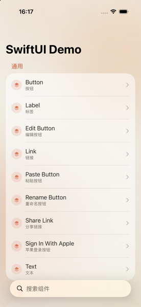
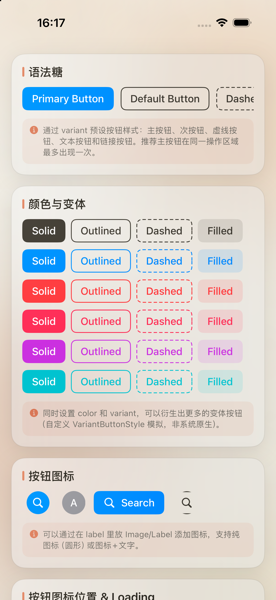
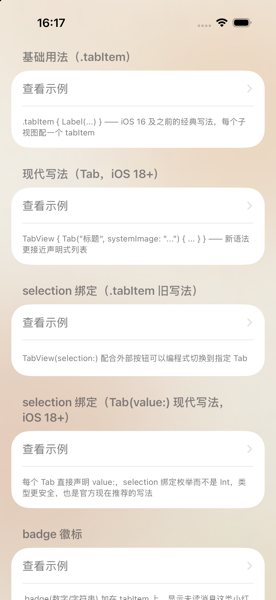
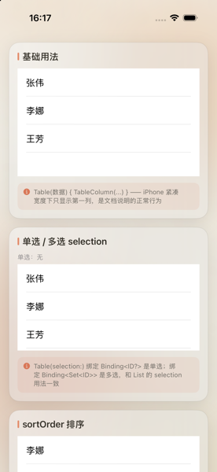
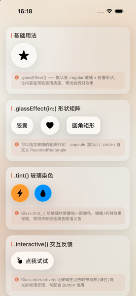

# SwiftUI Demo

一个纯 SwiftUI 原生实现的组件速查表 App。

灵感来自 [Ant Design](https://ant.design) 官网的组件文档形式——把每个原生组件的常用初始化方式、关键修饰符、变体一次性枚举展示出来，方便学习和查阅，而不是写一堆零散的 Demo 项目到处找。

## 截图

| 首页 | Button | TabView |
| --- | --- | --- |
|  |  |  |

| Table | Liquid Glass |
| --- | --- |
|  |  |

## 项目结构

- 每个原生组件对应一个 `XxxDemo.swift` 文件，按官方组件名命名
- `ComponentDemoSection.swift` 提供统一的卡片容器 `DemoSection(title:note:content:)`，所有示例都包在里面，保证排版统一
- `HomeView.swift` 是首页入口，按分类（通用 / 布局 / 导航 / 数据录入 / 数据展示 / 反馈 / Liquid Glass）列出所有组件，支持搜索
- `Theme.swift` / `GlassBackground.swift` / `GlassStyle.swift` 是全局视觉样式

## 内容规范

- API 覆盖尽量全：初始化重载、关键 modifier、颜色与变体矩阵、图标、尺寸、禁用态等
- SwiftUI 原生没有的视觉变体（比如 Ant Design 的 Outlined/Dashed/Filled 等按钮变体）通过自定义 `ButtonStyle` 等协议模拟，并在 `note` 里明确标注"自定义模拟，非系统原生"，避免误导
- 已废弃或平台不可用的 API 只做文字说明，不写实现代码

## 运行

用 Xcode 打开 `SwiftUI Demo.xcodeproj`，选择任意 iOS 模拟器运行即可。
